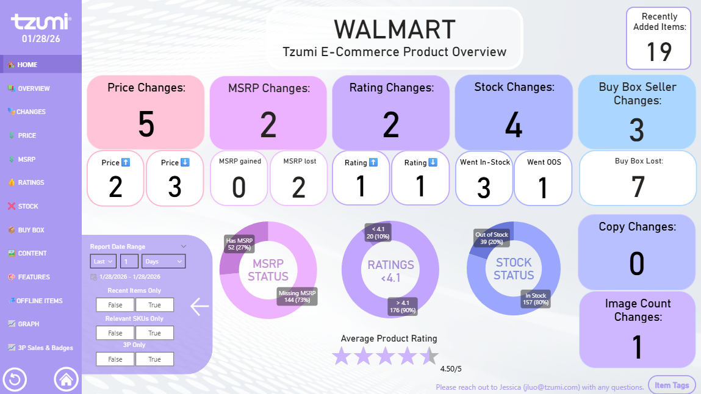
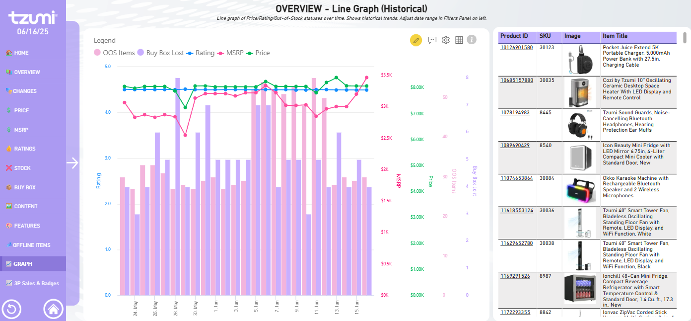
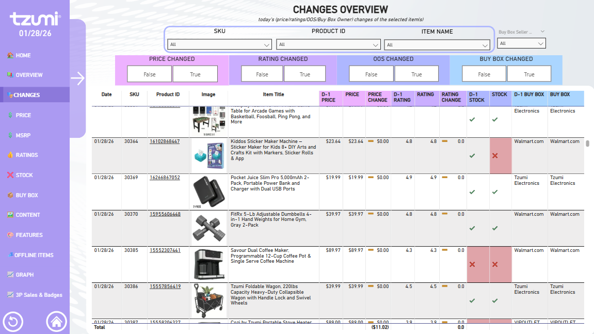

# Walmart E-Commerce & Competitive Intelligence Dashboard (Tzumi)

## Project Overview
This professional Power BI solution provides real-time monitoring and historical analysis for the **Tzumi** brand’s product catalog on **Walmart.com**. The dashboard acts as a central "War Room" for e-commerce managers to track pricing volatility, Buy Box ownership, and inventory health in a highly competitive marketplace.

## Technical Implementation
To meet modern BI engineering standards, this project utilizes:
* **Power BI Project (.pbip) Format:** Enables granular version control and transparency for DAX and metadata.
* **Git Integration:** Full development lifecycle managed via GitHub to track logic changes.
* **Advanced Data Modeling:** Integrated disparate data points including MSRP, price shifts, and seller status to identify revenue leakage.

## Marketplace Insights (As of Jan 28, 2026)
The dashboard currently identifies several critical operational areas:
* **Buy Box Performance:** Recorded **7 Buy Box losses**, indicating that third-party sellers are successfully out-competing the brand for the primary "Add to Cart" button.
* **Inventory Alert:** Approximately **20% of the catalog (39 items)** is currently **Out of Stock**, representing immediate revenue loss.
* **Pricing Volatility:** Tracked **5 Price Changes** and **2 MSRP shifts** within a 24-hour window, highlighting the aggressive price-matching environment.
* **Brand Health:** Maintains a strong average product rating of **4.5/5 stars**, though individual items like the **FitRx Massager ($190.00)** are closely monitored for sentiment shifts.

## Dashboard Features

### 1. Daily Executive Summary
A high-level view of daily changes in Price, MSRP, Ratings, and Stock status to drive immediate operational action.

### 2. Historical Trend Analysis
Utilizes line graphs to correlate how fluctuations in **MSRP** and **Average Rating** impact **Buy Box ownership** and **Out-of-Stock (OOS)** frequency over time.

### 3. Granular Item Audit
A detailed table view providing SKU-level transparency into pricing, review counts, and current Buy Box winners for the entire catalog.

## 📸 Project Gallery
#### Executive Overview


#### Historical Trends


#### SKU Audit


---
*Note: This repository contains the report structure and logic. For data security, API tokens and sensitive connection strings have been parameterized and removed.*

## DAX & Logic Highlights
Rather than just "drag-and-drop" visual creation, I used advanced DAX to solve complex business questions. 

**Example: Year-over-Year Growth**
```dax
YoY Sales = 
VAR CurrentSales = [Total Sales]
VAR PreviousSales = CALCULATE([Total Sales], SAMEPERIODLASTYEAR('Date'[Date]))
RETURN
DIVIDE(CurrentSales - PreviousSales, PreviousSales)
```
**Example: MSRP Price Comparison**
```dax
CHECK_WalmartMSRPLowerThanTzumi = 
VAR LatestWalmartMSRP = 
    CALCULATE(
        MAX('PRODUCT_DETAILED'[LIST_PRICE]),
        ALLEXCEPT('PRODUCT_DETAILED', 'DIM_PRODUCTS_1'[CHANNEL_PRODUCT_ID])
    )
VAR SKU = 
    LOOKUPVALUE(
        'Product IDs to SKUs'[SKU],
        'Product IDs to SKUs'[Product ID],
        MAX('DIM_PRODUCTS_1'[CHANNEL_PRODUCT_ID])
    )
VAR TzumiMSRP = 
    LOOKUPVALUE(
        'TZUMI_FITRX_LINKS'[MSRP],
        'TZUMI_FITRX_LINKS'[SKU], 
        SKU
    )
RETURN 
    IF(NOT ISBLANK(TzumiMSRP) && LatestWalmartMSRP < TzumiMSRP, TRUE(), FALSE())
